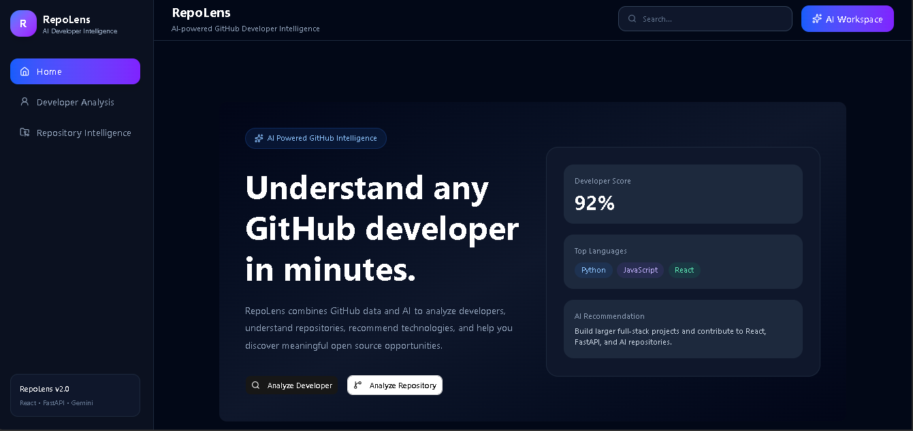
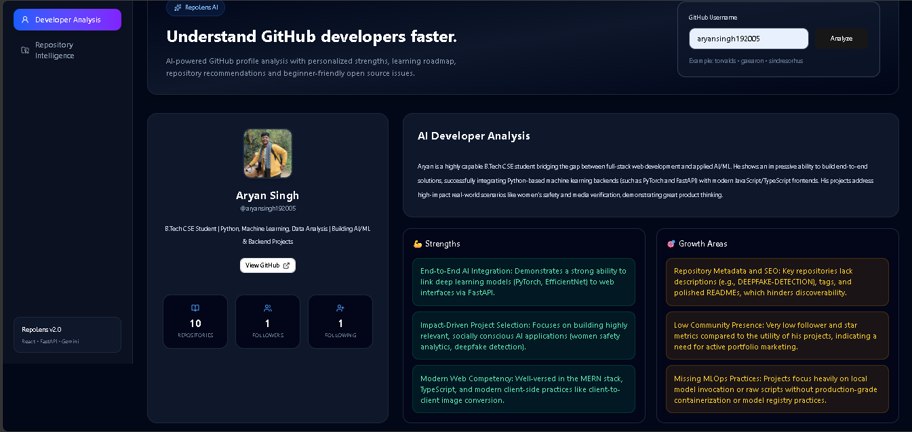
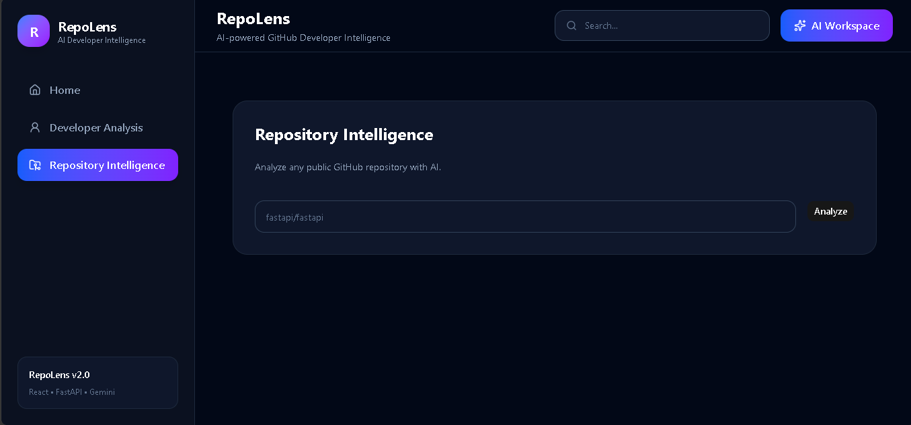
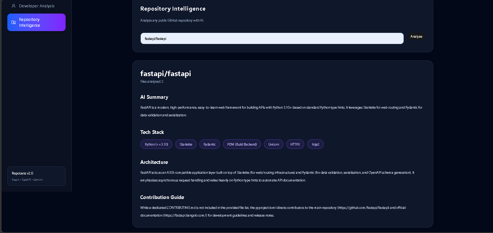

# 🚀 RepoLens v2.0

> **AI-Powered GitHub Developer Intelligence Platform**

RepoLens is a full-stack AI application that analyzes GitHub developers and repositories using GitHub APIs and Google Gemini AI. It helps developers understand coding strengths, discover learning opportunities, explore repositories, and find beginner-friendly open-source contributions.

---

## ✨ Features

### 👨‍💻 AI Developer Analysis

- Analyze any public GitHub profile
- AI-generated developer summary
- Strengths & growth areas
- Recommended technologies
- Personalized 30-day learning roadmap

### 📦 Repository Intelligence

- Analyze any public GitHub repository
- Understand project architecture
- Technology stack detection
- Repository overview
- Contribution guidance

### 🤖 Open Source Recommendations

- Beginner-friendly issue recommendations
- Compatibility scoring
- Difficulty estimation
- Personalized recommendations based on developer profile

### ⚡ Performance Optimizations

- Unified dashboard API
- Backend caching
- Repository caching
- Optimized AI prompts
- Reduced duplicate API calls

---

# 🛠 Tech Stack

## Frontend

- React
- Vite
- Tailwind CSS
- React Router
- Axios
- Lucide Icons

## Backend

- FastAPI
- Python
- PyGithub
- Google Gemini API

## APIs

- GitHub REST API
- Google Gemini API

---

# 🏗 Architecture

```
                 React Frontend
                        │
                        ▼
                 FastAPI Backend
                        │
        ┌───────────────┼────────────────┐
        │               │                │
        ▼               ▼                ▼
 GitHub Service   AI Service     Repository Service
        │               │                │
        └───────┬───────┴────────────────┘
                ▼
         Unified Dashboard API
```

---

# 📸 Screenshots

## 🏠 Landing Page



---

## 👨‍💻 Developer Dashboard



---

## 📦 Repository Intelligence



---

## 📖 Repository Analysis



---

# ⚙ Installation

## Clone the repository

```bash
git clone https://github.com/aryansingh192005/RepoLens-v2.0.git
```

---

## Backend

```bash
cd server

python -m venv venv

venv\Scripts\activate

pip install -r requirements.txt

uvicorn app.main:app --reload
```

---

## Frontend

```bash
cd client

npm install

npm run dev
```

---

# 🔑 Environment Variables

## Backend (.env)

```env
GITHUB_TOKEN=your_github_token
GEMINI_API_KEY=your_gemini_api_key
```

## Frontend (.env)

```env
VITE_API_URL=http://127.0.0.1:8000
```

---

# 📂 Project Structure

```
RepoLens-v2.0
│
├── client
│   ├── components
│   ├── pages
│   ├── services
│   └── assets
│
├── server
│   ├── app
│   │   ├── services
│   │   ├── cache
│   │   └── main.py
│   └── requirements.txt
│
└── docs
    └── images
```

---

# 🚀 Highlights

- AI-powered GitHub developer analysis
- Repository intelligence
- FastAPI service architecture
- Unified dashboard endpoint
- Backend caching
- Responsive React UI
- Modular component architecture
- Error handling & graceful fallbacks

---

# 🔮 Future Improvements

- Authentication
- Repository comparison
- Developer leaderboard
- AI code review
- Pull request analysis
- Team analytics
- Export reports (PDF)

---

# 👨‍💻 Author

**Aryan Singh**

B.Tech Computer Science & Engineering

GitHub: https://github.com/aryansingh192005

LinkedIn: https://www.linkedin.com/in/aryansingh192005

---

## ⭐ If you found this project interesting, consider giving it a star!